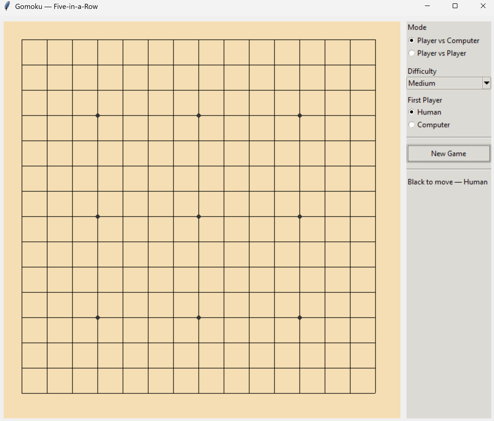

# Gomoku — Five-in-a-Row (15x15)

A classic **Gomoku** game implemented in Python with a **Tkinter GUI**, supporting both **Player vs Player (PvP)** and **Player vs Computer (PvC)** modes with adjustable AI difficulty levels.


---

## Features
- **15x15 Gomoku board** with smooth, responsive UI.
- **Game modes:**
  - Player vs Player (PvP)
  - Player vs Computer (PvC)
- **AI Difficulty Levels:** Easy, Medium, Hard
  - Easy: Random moves.
  - Medium: Greedy evaluation + simple threat detection.
  - Hard: Negamax search with alpha-beta pruning.
- Visual highlights:
  - Star points for reference (like Go boards)
  - Last move marker (red square)
  - Winning line glow when a player wins
- **New Game** button to reset quickly.
- Adjustable **who goes first** in PvC mode (Human or Computer).

---

## Requirements
- Python 3.8+
- Tkinter (usually included by default with Python installations)

---

## Installation
1. **Clone the repository:**
   ```bash
   git clone https://github.com/albertkojo/gomoku.git
   cd gomoku
   ```

2. **(Optional) Create a virtual environment:**
   ```bash
   python -m venv venv
   source venv/bin/activate  # On Windows: venv\Scripts\activate
   ```

3. **Install dependencies:**
   > No external libraries are required beyond Tkinter.

---

## Running the Game
Run the following command in your terminal:
```bash
python gomoku_gui.py
```

The game window will launch, and you can start playing immediately.

---

## How to Play
- Players alternate placing stones on the grid intersections.
- The **first player (Black)** always starts.
- The goal is to **align five consecutive stones** horizontally, vertically, or diagonally.
- The game ends when a player wins or the board fills completely (draw).

**Controls:**
- Click on the board intersections to place a stone.
- Use the sidebar to:
  - Switch between PvP and PvC.
  - Set AI difficulty.
  - Choose whether the computer or human plays first.
  - Start a new game.

---

## Project Structure
```
Gomoku/
├── gomoku_gui.py      # Main game script with GUI, AI, and game logic
├── README.md          # Documentation
└── gomoku.png     # Screenshot for the game
```

---

## Future Improvements
- Add undo/redo functionality.
- Implement more advanced AI heuristics for Hard mode.
- Add sound effects and animations.
- Support custom board sizes.
- Package the project for easy installation (PyPI).

---


